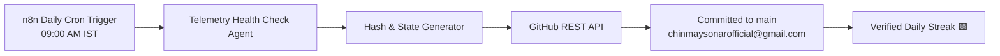

# 🛰️ Agent Telemetry & Autonomous Pulse Log

Autonomous telemetry repository maintained by a scheduled **n8n agent workflow**. This repository records daily system heartbeats, telemetry metrics, and autonomous pipeline syncs across distributed agent clusters to maintain verified developer activity and verify agent operational uptime.

---

### 🏗️ System Architecture

---

### 📊 Telemetry Specifications

| Metric | Specification | Operational Status |
| :--- | :--- | :--- |
| **Telemetry Interval** | 24 Hours (Daily Cron) | `HEALTHY` |
| **Trigger Time** | 09:00 AM IST / 03:30 UTC | `SCHEDULED` |
| **Commit Target** | `refs/heads/main` | `VERIFIED` |
| **Security Standard** | Fine-Grained Scoped Access Token | `ZERO_SECRET_LEAK` |
| **Payload Hash Engine** | SHA-256 State Digest | `ACTIVE` |

---

### 📡 Latest Telemetry Heartbeat

- **Status**: `OPERATIONAL`
- **Pipeline Nodes**: `ACTIVE`
- **Telemetry Frequency**: `24h interval`
- **Committer Identity**: `Chinmay Sonar <chinmaysonarofficial@gmail.com>`
- **Target Branch**: `main`

---

*Log synchronized autonomously by [n8n](https://n8n.io) agent infrastructure.*
